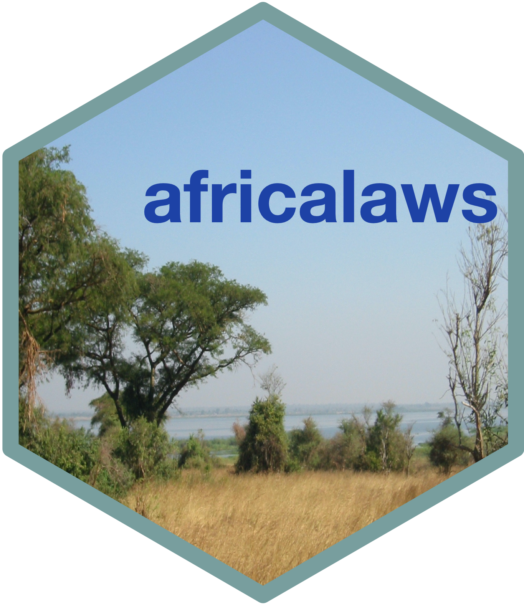

<!-- README.md is generated from README.Rmd. Please edit that file -->

# africalaws: Interface to the Laws.Africa API 

<!-- badges: start -->

<!-- badges: end -->

Laws.Africa <https://laws.africa> endeavours to facilitate African
governments in offering sustainable, free access to dependable digital
laws. It aims to achieve this by ensuring that the laws are easily
accessible, user-friendly, educational, and reusable. This initiative
seeks to empower citizens with knowledge of their legal rights and
obligations while promoting transparency and accountability within the
legal system. Laws.Africa offers a content application programming
interface (API) to fetch legislative content and metadata. The API is a
read-only API for listing and fetching published versions of legislative
works. This package interfaces with this API to allow access using R.
